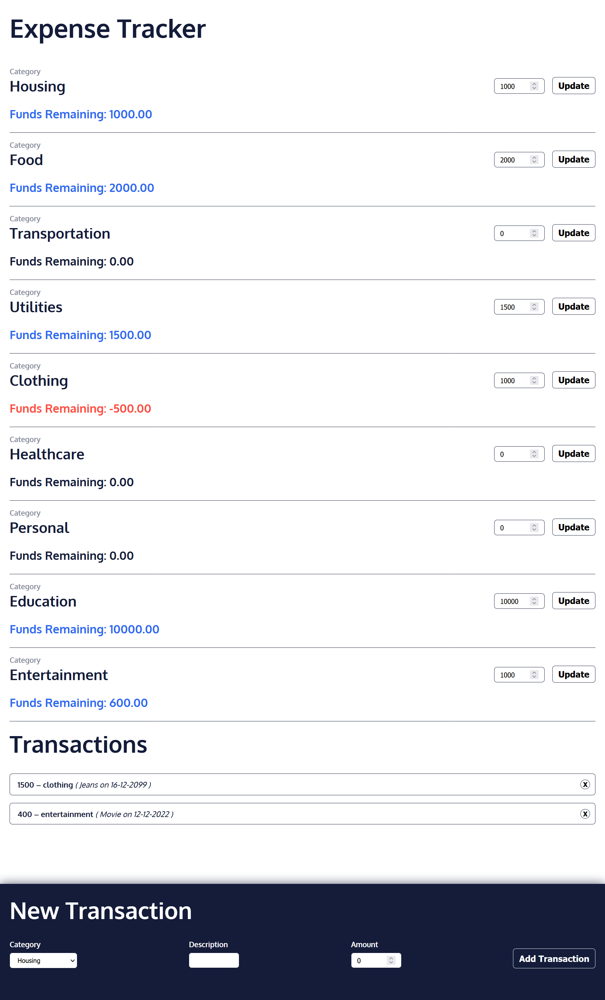

# Expense Tracker

An expense tracker website where one can track his income and expenses. It uses React for the components and redux for state management.

Check it live here: https://ashutosh-874.github.io/expense_tracker/

### Installation

1 - Setup the Project

```bash
git clone https://github.com/ashutosh-874/expense_tracker.git
cd expense_tracker
```

2 - Install Dependencies

```bash
npm install
```

3 - Runserver on port 3000

```bash
npm start
```

